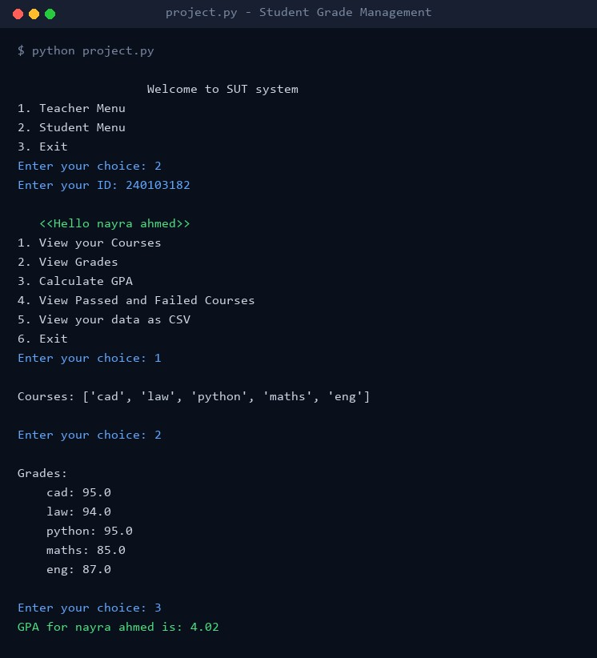

# Student Grade Management System

A command-line Python program for managing students, courses, grades, and GPAs, with separate menus for teachers and students.

Built as a university programming project (Year 1).



## Features

### Teacher menu (username and password required)

- **Add students** with a 9-digit ID and a name made of letters only. Entering an ID that already exists offers to rename that student
- **Delete students** by ID
- **Add courses** with credit hours, either to every student at once or to students picked from a numbered list
- **Rename a course** for every student who has it
- **Remove a course** from every student or from selected students
- **Enter grades** as a numeric score for a student's course
- **Calculate a student's GPA** by ID
- **Export to CSV**: all students, one student by ID, or every grade for one course

### Student menu (log in with your student ID)

- **View your courses** and **your grades**. Ungraded courses show "No grade yet"
- **Calculate your GPA**
- **See passed and failed courses**. The pass mark is 50
- **Export your record** to `student_data.csv`

## Grading scale

Scores are converted to grade points as follows. Scores are not converted to letter grades.

| Score | Points |
|---|---|
| 95 and above | 4.3 |
| 90 to below 95 | 4.0 |
| 85 to below 90 | 3.7 |
| 80 to below 85 | 3.3 |
| 75 to below 80 | 3.0 |
| 70 to below 75 | 2.7 |
| 65 to below 70 | 2.3 |
| 60 to below 65 | 2.0 |
| 57 to below 60 | 1.7 |
| 54 to below 57 | 1.3 |
| 50 to below 54 | 1.0 |
| Below 50 | 0.0 |

Because the top band is worth 4.3, a GPA can be higher than 4.0.

## Run it

You need Python 3. No extra packages are required.

```bash
python project.py
```

Run it from the project folder, because `students_file.json` is loaded from the current directory when the program starts. The repository includes this file with sample data. The teacher username and password are set at the top of `project.py`.

## How it works

- All data is kept in one list of student dictionaries. Each student has a `name`, an `id`, and a `courses` dictionary that maps a course name to its `grade` and `credit_hours`.
- The list is written to `students_file.json` after every change and reloaded each time you return to the main menu, so changes are kept between runs.
- The GPA is a credit-hour weighted average: each graded course contributes its grade points multiplied by its credit hours, and the total is divided by the credit hours of the graded courses. Ungraded courses are listed and skipped.
- Student lists and exports are sorted alphabetically by name. Course names are stored in lowercase, so lookups are not case-sensitive.

## Project structure

```
project.py            the whole program: menus, data handling, GPA, CSV export
students_file.json    saved student, course, and grade data (sample data included)
all_students.csv      example export of all students
student_data.csv      example export of a single student
course_data.csv       export of one course's grades (empty in the repository)
screenshots/          images used in this README
```
